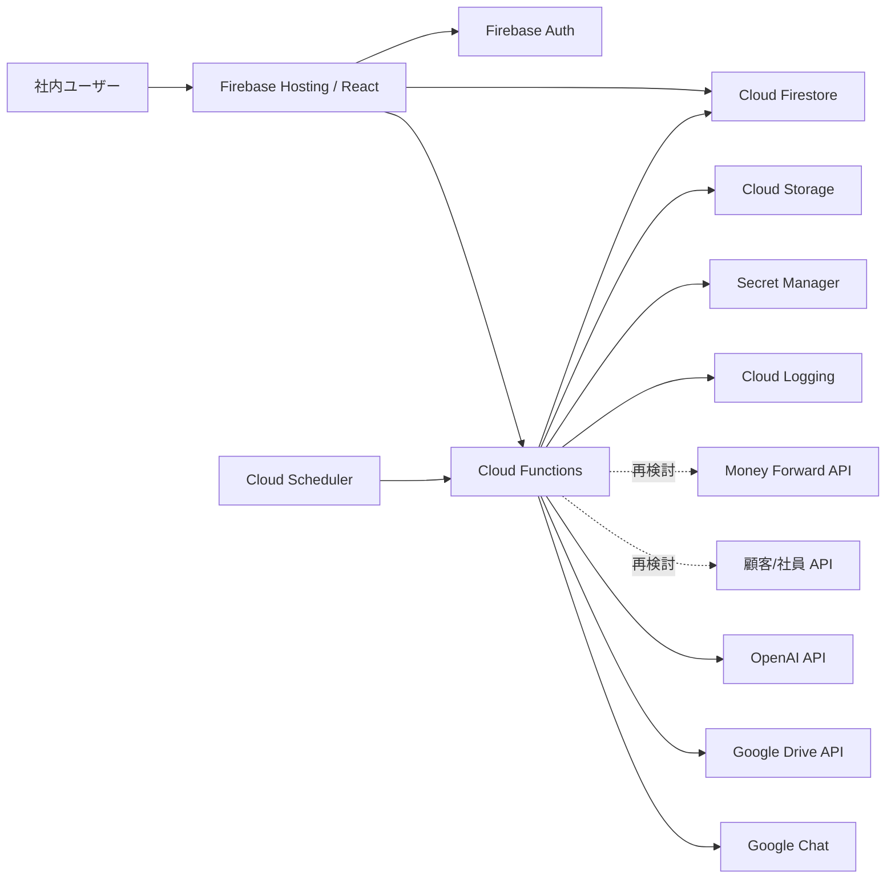

# Firebase リビルド 詳細設計書

## 1. 設計方針

現行 Laravel/MySQL の業務概念を維持し、Firebase では次の責務に分ける。

新システムの DB は Cloud Firestore とする。MySQL は現行システムの DB であり、移行元と移行検証用の比較対象としてのみ扱う。

| Firebase 機能 | 責務 |
| --- | --- |
| Firebase Hosting | React アプリ配信 |
| Firebase Auth | ログイン、UID 管理、カスタムクレーム |
| Cloud Firestore | 業務データ保存 |
| Cloud Functions | サーバー側業務処理、外部 API、AI、帳票生成、集計 |
| Cloud Storage | 帳票 PDF、添付ファイル、会社ロゴ/印影 |
| Cloud Scheduler | 月次スナップショット、同期、集計更新 |
| Secret Manager | 外部 API キー、OAuth クライアントシークレット、Webhook |
| Cloud Logging | 操作ログ、同期ログ、エラー監視 |

Money Forward API と顧客 API は Adapter 境界の内側に閉じ込め、業務画面・集計・データモデルが特定 API に直接依存しないようにする。

## 2. 全体構成



## 3. アプリケーション層

| 層 | 内容 |
| --- | --- |
| UI | React。現行 Inertia ページを Firebase Hosting 用 SPA として再構成 |
| State | React Query 等で Firestore/Functions の取得状態を管理 |
| Domain | 見積計算、工数換算、承認状態判定、事業区分集計 |
| Functions API | 認可が必要な更新、外部連携、帳票生成、AI 処理 |
| Repository | Firestore collection への読み書き |
| Adapter | Money Forward、顧客API、Google Drive、OpenAI、Google Chat |

ブラウザから直接更新してよいのは、Security Rules で安全に制御できる軽い閲覧/下書き更新に限定する。承認、受注確定、外部送信、金額確定、スナップショット更新は Cloud Functions 経由にする。

## 4. Firestore データ設計

### 4.1 コレクション一覧

| Collection | 用途 |
| --- | --- |
| `users` | ユーザープロファイル、外部ID、工数キャパ、既読バージョン |
| `companySettings` | 会社設定、税、採番、工数基準 |
| `customers` | 顧客マスタ。現行 `partners` 相当 |
| `customerDepartments` | 顧客部署/担当者。顧客配下の subcollection も可 |
| `categories` | 商品分類 |
| `products` | 商品マスタ |
| `estimates` | 見積本体 |
| `estimateEvents` | 見積操作履歴 |
| `localInvoices` | ローカル請求 |
| `externalBillings` | 外部請求キャッシュ。Money Forward 請求を採用する場合のみ |
| `maintenanceSnapshots` | 保守売上月次スナップショット |
| `dashboardAiAnalyses` | ダッシュボードAI分析キャッシュ |
| `salesAiCoachSettings` | 営業AIコーチ設定 |
| `salesAiCoachSessions` | 営業AIコーチ履歴 |
| `releaseNotes` | 更新履歴 |
| `integrationJobs` | 外部同期ジョブ、再試行状態 |
| `externalApiClients` | 外部向け API クライアント設定 |

### 4.2 `estimates`

```json
{
  "estimateNumber": "EST-7-84-261506-001",
  "customer": {
    "id": "customer_doc_id",
    "externalId": "mf_partner_id_or_future_id",
    "name": "顧客名",
    "departmentId": "department_id",
    "contactName": "担当者名",
    "contactTitle": "役職"
  },
  "title": "案件名",
  "issueDate": "2026-06-15",
  "dueDate": "2026-07-15",
  "startDate": "2026-07-01",
  "deliveryDate": "2026-07-31",
  "status": "draft",
  "isOrderConfirmed": false,
  "orderConfirmedAt": null,
  "lost": {
    "at": null,
    "reason": null,
    "note": null
  },
  "followUp": {
    "dueDate": null,
    "promptedAt": null,
    "decisionNote": null
  },
  "amounts": {
    "subtotalExcludingTax": 0,
    "salesSubtotalExcludingTax": 0,
    "developmentSubtotalExcludingTax": 0,
    "firstBusinessSubtotalExcludingTax": 0,
    "taxAmount": 0,
    "totalAmount": 0,
    "grossProfit": 0,
    "effortPersonDays": 0
  },
  "items": [],
  "approvalFlow": [],
  "approvalStarted": false,
  "notes": null,
  "acceptanceNotes": null,
  "internalMemo": null,
  "requirement": {
    "summary": null,
    "googleDocsUrl": null,
    "structured": null
  },
  "externalRefs": {
    "moneyForwardQuoteId": null,
    "moneyForwardQuotePdfUrl": null,
    "moneyForwardInvoiceId": null,
    "moneyForwardInvoicePdfUrl": null,
    "moneyForwardDeletedAt": null,
    "xeroProjectId": null,
    "xeroProjectName": null
  },
  "staff": {
    "uid": "firebase_uid",
    "externalUserId": "external_user_id",
    "name": "担当者名"
  },
  "createdAt": "serverTimestamp",
  "updatedAt": "serverTimestamp"
}
```

### 4.3 見積明細 `estimates.items[]`

```json
{
  "lineId": "uuid",
  "productId": "product_doc_id",
  "code": "A-001",
  "name": "設計",
  "description": "説明",
  "quantity": 1,
  "unit": "人月",
  "unitPrice": 600000,
  "cost": 220000,
  "taxCategory": "standard",
  "businessDivision": "fifth_business",
  "deliveryDate": "2026-07-31",
  "displayMode": "quantity",
  "internalCalculation": {
    "quantity": 1,
    "unit": "人月",
    "unitPrice": 600000
  },
  "lineSubtotalExcludingTax": 600000,
  "effortPersonDays": 20
}
```

### 4.4 `products`

```json
{
  "sku": "A-001",
  "categoryId": "category_doc_id",
  "seq": 1,
  "name": "商品名",
  "unit": "式",
  "price": 0,
  "quantity": null,
  "cost": 0,
  "taxCategory": "standard",
  "businessDivision": "fifth_business",
  "isActive": true,
  "description": null,
  "externalRefs": {
    "moneyForwardItemId": null,
    "moneyForwardUpdatedAt": null
  },
  "createdAt": "serverTimestamp",
  "updatedAt": "serverTimestamp"
}
```

### 4.5 `maintenanceSnapshots`

Document ID は `YYYY-MM` とする。

```json
{
  "month": "2026-06",
  "totalFee": 0,
  "totalGross": 0,
  "source": "api",
  "lastSyncedAt": "serverTimestamp",
  "items": [
    {
      "itemId": "uuid",
      "customerName": "顧客名",
      "maintenanceFee": 50000,
      "status": "active",
      "supportType": "standard",
      "entrySource": "api"
    }
  ],
  "createdAt": "serverTimestamp",
  "updatedAt": "serverTimestamp"
}
```

保守売上明細が多い場合は `maintenanceSnapshots/{month}/items/{itemId}` の subcollection に分ける。

### 4.6 `users`

```json
{
  "uid": "firebase_uid",
  "name": "氏名",
  "email": "user@example.com",
  "externalUserId": null,
  "role": "member",
  "workCapacityPersonDays": 20,
  "lastReadReleaseVersion": "v1.0.23",
  "hiddenFromBusiness": false,
  "createdAt": "serverTimestamp",
  "updatedAt": "serverTimestamp"
}
```

## 5. 採番設計

現行の `EST(-D)-{staff}-{client}-{yymmdd}-{seq}` を維持する。

Firestore では同時採番の衝突を避けるため、Cloud Functions の transaction で `sequences/estimateNumber-{date}-{staff}-{customerCode}-{kind}` を更新する。

```json
{
  "current": 3,
  "updatedAt": "serverTimestamp"
}
```

下書きと本採番を分ける場合は `kind = draft | regular` をキーに含める。

## 6. Cloud Functions API 設計

### 6.1 見積

| Function | 用途 |
| --- | --- |
| `createEstimate` | 採番、初期金額計算、作成 |
| `updateEstimate` | 明細正規化、金額/工数再計算、更新 |
| `duplicateEstimate` | 複製して新しい見積番号を採番 |
| `deleteEstimate` | 論理削除または削除扱い |
| `submitApproval` | 承認申請開始 |
| `approveEstimate` | 現在承認者の承認 |
| `cancelApproval` | 申請取消 |
| `confirmOrder` | 受注確定、着手日/納品日検証 |
| `cancelOrderConfirmation` | 受注取消 |
| `markEstimateLost` | 失注登録 |
| `acknowledgeOverduePrompt` | 期限超過判断メモ |
| `extendOverdueFollowUp` | フォロー期限延長 |

### 6.2 帳票

| Function | 用途 |
| --- | --- |
| `generateEstimatePreview` | 見積プレビュー生成 |
| `generatePurchaseOrderPreview` | 注文書プレビュー生成 |
| `generateAcceptancePreview` | 検収書プレビュー生成 |
| `renderPdf` | 必要に応じて PDF を生成し Storage へ保存 |

### 6.3 AI

| Function | 用途 |
| --- | --- |
| `analyzeRequirementDocument` | Google Drive 文書を取得し要件抽出 |
| `generateEstimateDraftFromRequirement` | 要件概要から明細ドラフト生成 |
| `generateNotes` | 対外備考生成 |
| `generateDashboardAnalysis` | ダッシュボード分析生成/キャッシュ |
| `generateSalesAiCoachResponse` | 営業AIコーチ応答 |

### 6.4 集計

| Function | 用途 |
| --- | --- |
| `recalculateEstimateMetrics` | 見積金額、粗利、工数を再計算 |
| `buildManagementMetrics` | 総合/開発/販売/保守の予実集計 |
| `buildBusinessDivisionReport` | 事業区分別の請求実績集計 |
| `captureMaintenanceSnapshot` | 月次保守売上スナップショット |

### 6.5 外部連携

| Function | 用途 | 状態 |
| --- | --- | --- |
| `syncMoneyForwardPartners` | MF取引先同期 | 新システムで再検討 |
| `syncMoneyForwardProducts` | MF品目同期 | 新システムで再検討 |
| `syncMoneyForwardQuotes` | MF見積同期 | 新システムで再検討 |
| `createMoneyForwardQuote` | MF見積作成 | 新システムで再検討 |
| `syncMoneyForwardBillings` | MF請求同期 | 新システムで再検討 |
| `fetchCustomersFromExternalApi` | 顧客API取込 | 新システムで再検討 |
| `syncExternalUsers` | 社員API取込 | 新システムで再検討 |
| `getConfirmedEstimates` | 外部向け受注確定見積一覧 | 認証方式を再設計 |

## 7. 業務ロジック設計

### 7.1 金額計算

見積の金額は Cloud Functions とフロントの共通ロジックで同じ計算にする。

- 税抜小計: 明細ごとの `quantity * unitPrice` を合算
- 消費税: 税区分に応じて計算
- 税込合計: 税抜小計 + 消費税
- 原価: `cost * quantity` または商品マスタ原価を利用
- 粗利: 税抜小計 - 原価
- 第1種小計: `businessDivision = first_business` の合算
- 開発小計: 第1種以外の合算

### 7.2 工数計算

| 単位 | 換算 |
| --- | --- |
| 人日、空欄 | `quantity` |
| 人月 | `quantity * personDaysPerPersonMonth` |
| 人時、時間、h、hr | `quantity / personHoursPerPersonDay` |
| その他 | 0 |

第1種事業の明細は工数対象外とする。

### 7.3 月次配賦

- 着手日と納品日がある場合、期間内の月に工数を均等配賦する。
- 納品日のみの場合は納品月へ一括配賦する。
- 日付がない場合は未配賦として扱う。

### 7.4 承認制御

- `approvalFlow` は配列で保持する。
- 現在ステップは、最初の未承認/未却下ステップとする。
- 承認操作時は Cloud Functions で UID と承認者 ID を照合する。
- 全ステップ承認後に `status = sent` とする。
- 粗利率ルールにより、必要承認者や社内メモ必須を検証する。

### 7.5 受注確定

- `status = sent` の見積のみ受注確定できる。
- 受注確定時に `isOrderConfirmed = true`、`orderConfirmedAt` を更新する。
- 受注取消時は `isOrderConfirmed = false` にする。
- 受注確定済み見積は失注にできない。

## 8. Security Rules 方針

Security Rules は閲覧範囲の一次防御とし、重要な状態変更は Cloud Functions で再チェックする。

```text
match /users/{uid}:
  本人は自分のプロフィールを閲覧可能。
  管理者は全ユーザーを閲覧/更新可能。

match /estimates/{estimateId}:
  認証済みユーザーは閲覧可能。
  下書き作成者は draft 更新可能。
  承認、受注確定、失注、削除は Cloud Functions のみ許可。

match /products/{productId}, /categories/{categoryId}:
  認証済みユーザーは閲覧可能。
  管理者のみ更新可能。

match /maintenanceSnapshots/{month}:
  認証済みユーザーは閲覧可能。
  管理者または Cloud Functions のみ更新可能。
```

## 9. 画面設計

| 画面 | 主なデータ | 主な操作 |
| --- | --- | --- |
| ログイン | Firebase Auth | ログイン、パスワード再設定 |
| ダッシュボード | `estimates`, 集計 Functions | 承認タスク、予実確認、AI分析確認 |
| 見積一覧 | `estimates` | 検索、絞り込み、詳細、複製、一括承認 |
| 見積作成/編集 | `estimates`, `customers`, `products`, `users` | 明細編集、承認申請、AIドラフト、受注確定 |
| 注文書 | `estimates` | 注文書プレビュー、印刷 |
| 検収書 | `estimates` | 検収書プレビュー、印刷 |
| 請求一覧 | `localInvoices`, `externalBillings` | 請求確認、PDF、外部連携候補 |
| ローカル請求編集 | `localInvoices` | 明細編集、保存、PDF |
| 商品管理 | `products`, `categories` | 商品/分類 CRUD |
| 保守売上管理 | `maintenanceSnapshots` | 月選択、検索、手修正、再同期候補 |
| 事業区分レポート | 集計 Functions | 年月指定、明細確認 |
| 管理 | `companySettings`, `users` | 工数基準、ユーザー別キャパ |
| 更新履歴 | `releaseNotes`, `users` | 既読管理 |
| ヘルプ | 静的/Firestore | 操作説明、API仕様 |
| 営業AIコーチ | `salesAiCoachSessions` | チャット、設定 |

## 10. 外部向け API 設計

Cloud Functions の HTTPS endpoint として提供する。

| Endpoint | 用途 |
| --- | --- |
| `GET /api/v1/confirmed-estimates` | 受注確定済み見積一覧 |
| `GET /api/v1/confirmed-estimates/{id}` | 受注確定済み見積詳細 |

認証方式は再検討する。候補は次のとおり。

- API key + HMAC 署名
- Firebase App Check + サーバー間 token
- Identity Platform / OAuth2 client credentials 相当
- 現行互換の Bearer token

現行互換の Bearer token は最も単純だが、漏えい時の影響が大きいため、採用する場合は Secret Manager、ローテーション、IP制限、監査ログを必須にする。

## 11. Money Forward 連携の再検討設計

新システムでは、Money Forward 連携を次の interface に閉じ込める。

```ts
interface AccountingAdapter {
  listCustomers(): Promise<CustomerExternalRecord[]>
  listProducts(): Promise<ProductExternalRecord[]>
  listQuotes(updatedSince?: string): Promise<QuoteExternalRecord[]>
  createQuote(input: CreateQuoteInput): Promise<CreateQuoteResult>
  convertQuoteToBilling(quoteId: string): Promise<ConvertBillingResult>
  listBillings(updatedSince?: string): Promise<BillingExternalRecord[]>
  downloadPdf(ref: ExternalPdfRef): Promise<StoragePdfResult>
}
```

初期リリースで必ず実装するかは別判断とする。内部業務は `AccountingAdapter` が未実装でも動くようにする。

再検討で決めること。

- 正本は新システムか Money Forward か
- 見積番号の採番責任
- 取引先/部署/品目の同期方向
- OAuth の所有者
- 自動同期頻度
- 削除検知
- 同期失敗時の業務停止条件

## 12. 顧客 API / 社員 API 連携の再検討設計

現行の顧客/社員 API は次の interface に閉じ込める。

```ts
interface DirectoryAdapter {
  listCustomers(query?: CustomerQuery): Promise<CustomerRecord[]>
  listUsers(query?: UserQuery): Promise<UserRecord[]>
  listMaintenanceFees(month: string): Promise<MaintenanceFeeRecord[]>
}
```

再検討で決めること。

- 顧客マスタの正本
- 保守費用の正本
- 社員マスタの正本
- Firebase Auth ユーザーとの紐付けキー
- API 障害時の代替運用
- 過去月スナップショットの取り込み範囲

## 13. 移行設計

### 13.1 移行対象

| 現行 | Firebase |
| --- | --- |
| `users` | `users` |
| `company_settings` | `companySettings/default` |
| `partners` | `customers` |
| `categories` | `categories` |
| `products` | `products` |
| `estimates` | `estimates` |
| `local_invoices` | `localInvoices` |
| `billings`, `billing_items` | `externalBillings` |
| `maintenance_fee_snapshots`, `maintenance_fee_snapshot_items` | `maintenanceSnapshots` |
| `sales_ai_coach_*` | `salesAiCoachSettings`, `salesAiCoachSessions` |

### 13.2 移行対象外

- `mf_tokens`
- Laravel `sessions`
- password reset tokens
- cache / jobs / failed jobs

Money Forward OAuth token は再認証または新しい保管方式へ切り替える。

### 13.3 検証

- 見積件数、受注確定件数、失注件数が一致する。
- 見積ごとの税抜小計、税込合計、工数が一致する。
- 月別保守売上合計が一致する。
- 商品コードと分類の連番が一致する。
- 顧客名、担当者、外部IDが移行されている。
- 受注確定済み見積 API 相当の返却値が現行と一致する。

## 14. 運用設計

| 操作 | 実行場所 |
| --- | --- |
| 月次保守スナップショット | Cloud Scheduler + Functions |
| 集計キャッシュ更新 | Functions |
| 外部同期 | Functions。ただし方式は再検討 |
| エラーログ確認 | Cloud Logging |
| APIキー更新 | Secret Manager |
| リリース履歴更新 | `releaseNotes` |

## 15. テスト設計

| 分類 | 内容 |
| --- | --- |
| Unit | 金額計算、工数換算、月次配賦、採番キー生成 |
| Functions | 見積作成、承認、受注確定、失注、AI失敗時エラー |
| Rules | 権限外更新不可、承認/受注確定の直接更新不可 |
| E2E | ログイン、見積作成、承認、受注確定、帳票、保守売上 |
| Migration | MySQL と Firestore の件数/金額/工数比較 |
| Integration | Money Forward/顧客API は再検討後に個別追加 |

## 16. 未確定事項

| 項目 | 状態 |
| --- | --- |
| Money Forward API 連携 | 新システムで再検討 |
| 顧客 API 連携 | 新システムで再検討 |
| 社員 API 連携 | 新システムで再検討 |
| 外部向け API の認証方式 | 新システムで再検討 |
| PDF 生成方式 | Firebase Storage 保存方式とブラウザ印刷方式を比較 |
| データ正本 | 顧客、商品、請求ごとに再整理が必要 |
| Firebase プラン | 想定アクセス数、保存量、Functions 実行回数から試算が必要 |
